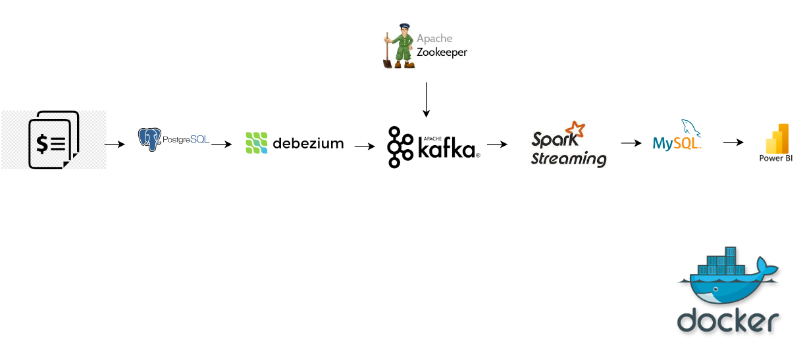

# Data Engineering Pipeline Project

## Overview

This project implements a data engineering pipeline that processes transactions data from a PostgreSQL database using a real-time streaming architecture. It leverages Debezium for CDC (Change Data Capture), Apache Kafka for message streaming, Spark Streaming for real-time data processing, and MySQL as a data sink for processed data. The processed data is then visualized in Power BI.

## Architecture

### Transactions Data
Stored in a PostgreSQL database.

### Debezium
Captures changes in the PostgreSQL database in real-time and streams these events to Kafka.

### Apache Kafka
Acts as the central message broker, handling streaming data with the help of Zookeeper for coordination.

### Spark Streaming
Processes real-time data from Kafka and transforms it as needed.

### MySQL
Stores the processed data.

### Power BI
Visualizes the data stored in MySQL, providing insights and analytical dashboards.

## Prerequisites

- **Docker**: For setting up PostgreSQL, Debezium, Kafka, Spark, and other services.
- **MySQL**: Database for raw and processed data storage.
- **Power BI**: For data visualization.

## Components and Setup

1. **PostgreSQL Database**  
   Used to store the initial transaction data.  
   Can be set up in Docker using a PostgreSQL image.

2. **Debezium**  
   Captures changes in PostgreSQL and sends them to Kafka.  
   Requires configuration for PostgreSQL to enable logical replication.

3. **Apache Kafka & Zookeeper**  
   Kafka serves as the message broker, with Zookeeper managing Kafka nodes.

4. **Spark Streaming**  
   Consumes data from Kafka, processes it in real-time, and pushes the processed data to MySQL.  
   Requires configuration to connect to Kafka topics and MySQL.

5. **MySQL Database**  
   Stores the final, processed data from Spark.  
   Acts as the data source for Power BI.

6. **Power BI**  
   Connects to MySQL and visualizes the processed data.

## Setup Instructions

```bash
docker-compose up -d

Create the smartphones Table: After starting the Postgres container, navigate into it and create the smartphones table


-- Create the smartphones database (in Mysql)
CREATE DATABASE smartphones;

USE smartphones;

-- Create tables to store data coming from Spark Streaming job

-- Table for summary statistics
CREATE TABLE statistics_summary (
    total_phones INT,
    max_price DOUBLE,
    max_screen_size DOUBLE,
    max_ram DOUBLE,
    max_rom DOUBLE,
    max_battery DOUBLE,
    updated_at TIMESTAMP DEFAULT CURRENT_TIMESTAMP ON UPDATE CURRENT_TIMESTAMP
);

-- Table for number of phones per brand
CREATE TABLE phones_per_brand (
    brand VARCHAR(100),
    total_phones INT,
    updated_at TIMESTAMP DEFAULT CURRENT_TIMESTAMP ON UPDATE CURRENT_TIMESTAMP,
    PRIMARY KEY (brand)
);

-- Table for number of phones per SIM type
CREATE TABLE phones_per_sim_type (
    sim_type VARCHAR(50),
    total_phones INT,
    updated_at TIMESTAMP DEFAULT CURRENT_TIMESTAMP ON UPDATE CURRENT_TIMESTAMP,
    PRIMARY KEY (sim_type)
);

-- Table for max price per brand
CREATE TABLE max_price_per_brand (
    brand VARCHAR(100),
    max_price DOUBLE,
    updated_at TIMESTAMP DEFAULT CURRENT_TIMESTAMP ON UPDATE CURRENT_TIMESTAMP,
    PRIMARY KEY (brand)
);

-- Table for max price per SIM type
CREATE TABLE max_price_per_sim_type (
    sim_type VARCHAR(50),
    max_price DOUBLE,
    updated_at TIMESTAMP DEFAULT CURRENT_TIMESTAMP ON UPDATE CURRENT_TIMESTAMP,
    PRIMARY KEY (sim_type)
);

-- Table for max RAM per brand
CREATE TABLE max_ram_per_brand (
    brand VARCHAR(100),
    max_ram DOUBLE,
    updated_at TIMESTAMP DEFAULT CURRENT_TIMESTAMP ON UPDATE CURRENT_TIMESTAMP,
    PRIMARY KEY (brand)
);

-- Table for max ROM per SIM type
CREATE TABLE max_rom_per_sim_type (
    sim_type VARCHAR(50),
    max_rom DOUBLE,
    updated_at TIMESTAMP DEFAULT CURRENT_TIMESTAMP ON UPDATE CURRENT_TIMESTAMP,
    PRIMARY KEY (sim_type)
);

-- Table for max battery capacity per brand
CREATE TABLE max_battery_per_brand (
    brand VARCHAR(100),
    max_battery DOUBLE,
    updated_at TIMESTAMP DEFAULT CURRENT_TIMESTAMP ON UPDATE CURRENT_TIMESTAMP,
    PRIMARY KEY (brand)
);

-- Table for max screen size per SIM type
CREATE TABLE max_screen_size_per_sim_type (
    sim_type VARCHAR(50),
    max_screen_size DOUBLE,
    updated_at TIMESTAMP DEFAULT CURRENT_TIMESTAMP ON UPDATE CURRENT_TIMESTAMP,
    PRIMARY KEY (sim_type)
);


Create a Debezium connector to capture changes from PostgreSQL and publish to Kafka. You can do this via the Debezium UI at localhost:8080


python insert-data-postgresDb.py
python spark-streaming-consumer.py  
